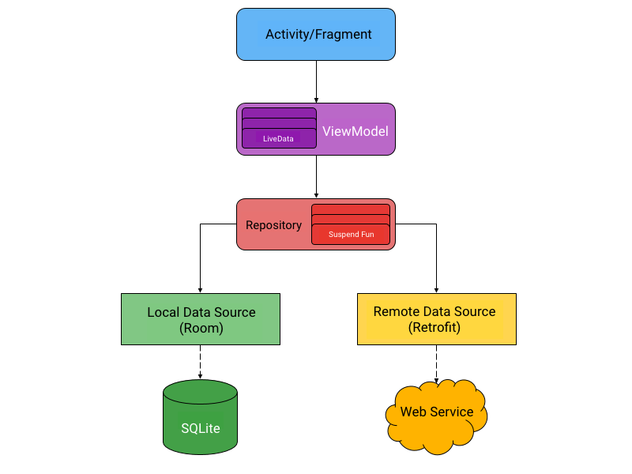

# Marvel Playground

## Introduction
**Marvel Playground** is an application that consumes Marvel API and where I can play with new android libraries and implementations.

## Architecture
The app uses **MVVM** as its architecture, as Google's own recommendation.

## Frameworks
- [Coroutines](https://github.com/Kotlin/kotlinx.coroutines)
- [Koin](https://github.com/InsertKoinIO/koin)
- [Coil](https://github.com/coil-kt/coil)
- [Lottie](https://github.com/airbnb/lottie-android)
- [Retrofit](https://github.com/square/retrofit)
- [Mockito](https://site.mockito.org/)
- [AndroidX](https://developer.android.com/jetpack/androidx?authuser=1)
- [Paging](https://developer.android.com/reference/android/arch/paging/package-summary)

## Preview

> **Note:** As it is a GIF, there is a limitation on the amount of colors ...

## IMPORTANT

> **Note:** To everything works as wanted, you need to change Marvel API key in keys.gradle file
